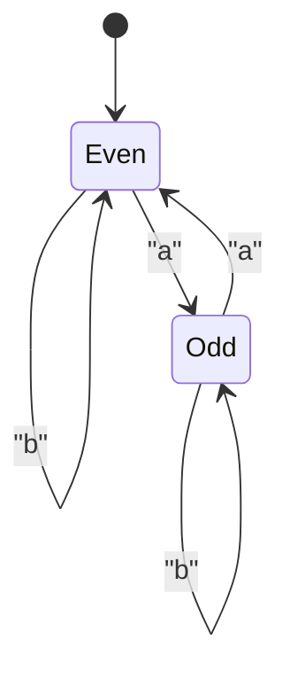
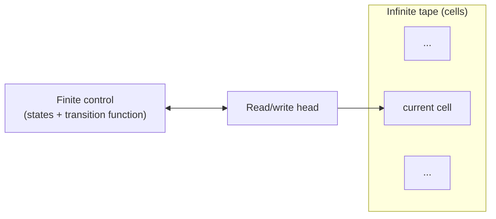
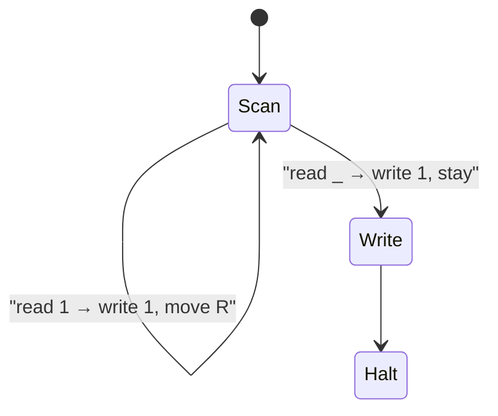

# CS301 – Week 6 Personal Guide  
**Focus:** §5.1 Formal Languages and §5.2 Turing Machines  
**Author:** Wesley Weaver • **Date:** November 2, 2025

---

## Week Overview
Because Chapter 5 on the Theory of Computing is beefy, we’re splitting it into two modules. This week covers **5.1 Formal Languages** and **5.2 Turing Machines**. Next week will focus on **5.3–5.5**. Use Princeton’s companion website for excerpts, sample Java code, and extra exercises.

### Suggested Videos (optional, “big picture”)
- *Formal Languages* – TrevTutor (~10 min)  
- *Regular Languages: DFA* – lydia (~7 min)  
- *Regular Languages: NFA* – lydia (~7 min)  
- *Turing Machines Explained* – Computerphile (~6 min)  
- *Turing Machines* – EngMicroLectures (~5 min)  

Links are in **References** below.

---

## Reading Roadmap
- **§5.1 Formal Languages (Princeton)** – alphabets, strings, languages, regex, DFAs/NFAs, closure properties, and lots of practice problems.  
- **§5.2 Turing Machines (Princeton)** – the TM model (tape, head, control), execution semantics, a unary→binary example, and a Java simulator with source.

Direct links in **References**.

---

## Key Concepts to Lock In
### Formal languages
- **Symbol:** a single atomic character from an alphabet.  
- **Alphabet (Σ):** finite set of symbols.  
- **String (word):** finite sequence over Σ. Empty string is ε.  
- **Language (L):** any set of strings over Σ (can be finite or infinite).

### Regular expressions and regular languages
- Operations: union `|`, concatenation, Kleene star `*`.  
- Useful patterns: parity, starts/ends with, “contains substring,” bounded counts, etc.  
- Closure: regular languages are closed under union, concatenation, star, complement, intersection, reverse, homomorphisms.
- Equivalence: **Regex ≡ NFA ≡ DFA** (Kleene’s theorem).

### Finite automata
- **DFA:** single next state per state+symbol; accepts if end state is accepting.  
- **NFA:** can branch or ε-move; accepts if *some* path ends in accept.  
- **Subset construction:** NFA → DFA.  
- Design tricks: encode recent suffixes in states; use product automata for combined conditions; rely on closure to compose languages.

#### Example DFA state diagram – parity of the number of `a` symbols
Strings over {a, b} with an **even** number of `a` symbols.



- Start state: `Even` (also the only accepting state).  
- Reading an `a` toggles between `Even` and `Odd`.  
- Reading a `b` leaves the parity unchanged.  

This is the classic pattern where a DFA’s states act like one bit of memory (“even vs odd”).


### Turing machines (high level)
- Components: **tape** (unbounded), **head** (R/L moves, reads/writes), **finite control** with states and a transition function.  
- Execution: read symbol → apply rule (write/move/state) → repeat until accept, reject, or run forever.  
- Power: general model of computation; some problems are unsolvable (e.g., Halting).  
- Practice: step through a concrete TM (like unary→binary) to see the control strategy.

- #### Turing machine components at a glance


- The tape stores symbols and can grow as needed.  
- The head reads and writes one cell at a time and moves left or right.  
- The finite control encodes the program as a state machine plus transition rules.

#### Example TM state diagram – unary increment
Machine that takes a unary number (a run of `1` symbols) and appends one more `1` at the end.

Input example: `111_` (underscore for blank) → Output: `1111_`



- `Scan`: move right across the block of `1`s until the first blank.  
- When the blank `_` is seen, go to `Write`, overwrite it with `1`, and then halt.  
- This shows how TM transitions combine **read symbol, write symbol, move direction, next state**.


---

## Hands‑On: Small Java Tools You Can Run
All of these are from the Princeton site.

### 1) Validate.java – quick regex checks
```bash
# compile
javac Validate.java StdIn.java StdOut.java

# run (pattern comes from shell, input is streamed)
echo 'bbbabbbb' | java Validate "(a|b)*a(a|b)(a|b)(a|b)(a|b)"
# prints [Yes] or [No]
```

### 2) Grep.java – grep‑like matching over a file
```bash
# compile
javac Grep.java In.java StdOut.java

# run
java Grep "a.*e.*i.*o.*u" /usr/dict/words
```

### 3) DFA.java – simulate a DFA from a transition table
```bash
# compile
javac DFA.java In.java ST.java StdIn.java StdOut.java

# run (b3.txt is a sample DFA spec from the site)
java DFA b3.txt < input.txt
```

### 4) Turing Machine simulator
- Download **turing.jar** and run:  
  ```bash
  java -jar turing.jar
  ```
- Source is available (Tape, Machine, UI classes). Read the code to see how tape and transitions are modeled.

Links to each file in **References**.

---

## Quiz 6 Notes (from my submissions)
> These are my study notes to reproduce the reasoning quickly on a closed‑book final.

### Q1 – Match terms and definitions
- **symbol** → basic building block, typically a character or a digit  
- **alphabet** → a finite set of symbols  
- **string** → a finite sequence of alphabet symbols  
- **formal language** → a set of strings (over the same alphabet)  
- **specification problem** → how to completely and precisely define languages  
- **recognition problem** → given L and x, decide whether x ∈ L

### Q2 – Regex over {a,b}: “starts with a and has odd length” **or** “starts with b and has even length”
**Correct pattern:**
```
a((a|b)(a|b))* | b(a|b)((a|b)(a|b))*
```
**Why:**  
- Left side `a((a|b)(a|b))*` enforces 1 + 2k symbols → odd length, starts with `a`.  
- Right side `b(a|b)((a|b)(a|b))*` enforces 2 + 2k symbols → even length, starts with `b`.

Common wrong answers and why they fail:
- `a((a|b)(a|b))*` only covers the “a and odd” half.  
- `a(aa)* | b(b)*` restricts interior letters to a single symbol and does not enforce even length on the `b` branch.  
- `a(a|b)* | b(a|b)(a|b)*` ignores parity constraints.

### Q3 – [pending]
I don’t have the exact prompt in my notes. General approach: translate each English constraint into a building block, then combine with union/concat/star and, if parity shows up, group characters in pairs `((a|b)(a|b))*` or use closure and anchors like “starts with” and “ends with.”

---

## Practice Checklist
- Do all **§5.1 Web Exercises** on regex and DFAs/NFAs.  
- For §5.2, trace the **unary→binary** TM by hand and explain the invariant for each state.  
- Use **DFA.java** with small DFAs you write yourself to check intuition.  
- Try converting small NFAs to DFAs via subset construction.  
- Explain closure proofs out loud: union, concatenation, star, complement, intersection.

---

## References and Code
**Primary booksite:**  
- §5.1 Formal Languages (text, exercises, code links)  
- `Validate.java` (regex checker)  
- `Grep.java` (grep‑like filter)  
- `DFA.java` (DFA simulator) with sample data `b3.txt`, `gene.txt`  
- §5.2 Turing Machines (TM intro, simulator downloads, unary→binary walk‑through, exercises)  
- Turing simulator **source** (`Tape.java`, `Machine.java`, `TuringMain.java`, …)  
- Chapter 6 “A Computing Machine” (TOY) – not in scope this week, but good context

**High‑authority extras:**  
- MIT OCW 6.045J (Automata, Computability, Complexity) – course page and lecture notes  
- Stanford CS103 notes on regular expressions and closure properties  
- Sipser errata (3rd edition) – verify formal statements  
- Wikipedia (for quick refreshers): NFA, Busy Beaver

**Video links (optional):**  
- TrevTutor – Formal Languages overview  
- lydia – DFA and NFA  
- Computerphile – Turing Machines, Halting, Busy Beaver

> All links verified as of November 2, 2025.

---

## Personal “One‑Pager” Recap
- Language = set of strings over Σ. Regex build regular languages; DFAs/NFAs recognize them; they are all equivalent in power.  
- Closure gives construction power. Combine small regular languages using union/concat/star/complement/intersection.  
- DFAs encode finite memory of the past; DFAs can enforce parity, suffix, and bounded‑lookback constraints.  
- Turing machines generalize computation with an unbounded tape. Some problems are unsolvable; termination is not guaranteed.  
- For parity regex, pair characters: `((a|b)(a|b))*`. To force starts/ends, prefix/suffix with anchors or explicit first/last symbols.  
- When stuck, draw the automaton first, then read off the language or regex.
