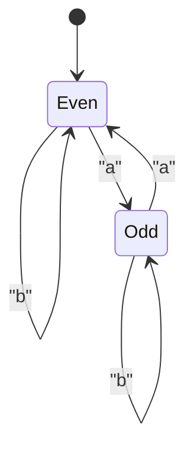
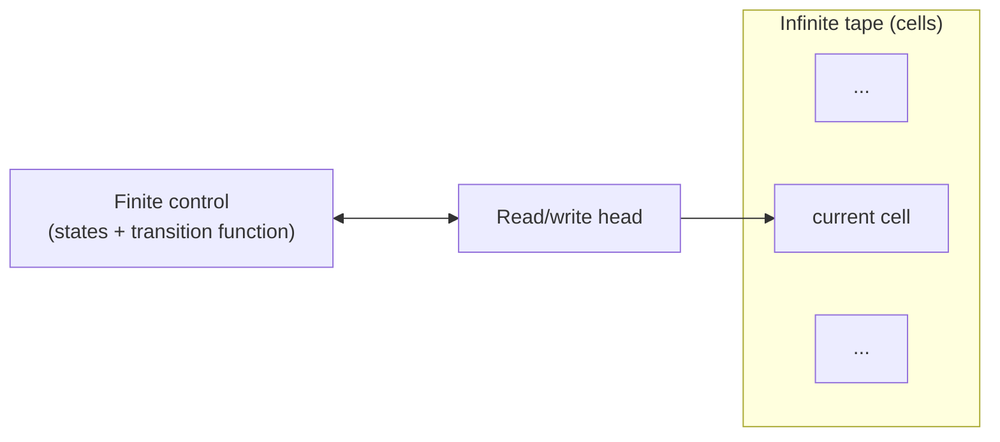
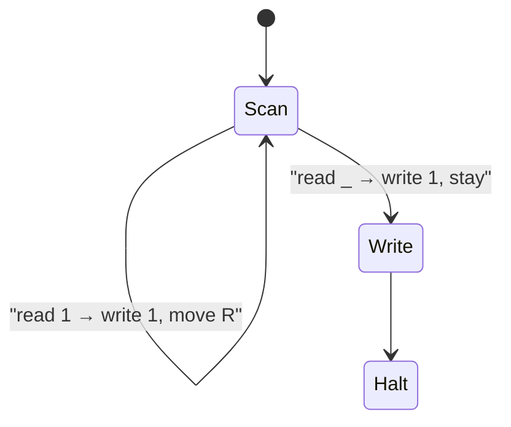

# CS301 – Week 6 Personal Guide  
**Focus:** §5.1 Formal Languages and §5.2 Turing Machines  
**Author:** Wesley Weaver • **Date:** November 2, 2025

---

## Week Overview
Because Chapter 5 on the Theory of Computing is beefy, we’re splitting it into two modules. This week covers **5.1 Formal Languages** and **5.2 Turing Machines**. Next week will focus on **5.3–5.5**. Use Princeton’s companion website for excerpts, sample Java code, and extra exercises.

### Suggested Videos (optional, “big picture”)
- *Formal Languages* – TrevTutor (~10 min)  
- *Regular Languages: DFA* – lydia (~7 min)  
- *Regular Languages: NFA* – lydia (~7 min)  
- *Turing Machines Explained* – Computerphile (~6 min)  
- *Turing Machines* – EngMicroLectures (~5 min)  

Links are in **References** below.

---

## Reading Roadmap
- **§5.1 Formal Languages (Princeton)** – alphabets, strings, languages, regex, DFAs/NFAs, closure properties, and lots of practice problems.  
- **§5.2 Turing Machines (Princeton)** – the TM model (tape, head, control), execution semantics, a unary→binary example, and a Java simulator with source.

Direct links in **References**.

---

## Key Concepts to Lock In
### Formal languages
- **Symbol:** a single atomic character from an alphabet.  
- **Alphabet (Σ):** finite set of symbols.  
- **String (word):** finite sequence over Σ. Empty string is ε.  
- **Language (L):** any set of strings over Σ (can be finite or infinite).

### Regular expressions and regular languages
- Operations: union `|`, concatenation, Kleene star `*`.  
- Useful patterns: parity, starts/ends with, “contains substring,” bounded counts, etc.  
- Closure: regular languages are closed under union, concatenation, star, complement, intersection, reverse, homomorphisms.
- Equivalence: **Regex ≡ NFA ≡ DFA** (Kleene’s theorem).

### Finite automata
- **DFA:** single next state per state+symbol; accepts if end state is accepting.  
- **NFA:** can branch or ε-move; accepts if *some* path ends in accept.  
- **Subset construction:** NFA → DFA.  
- Design tricks: encode recent suffixes in states; use product automata for combined conditions; rely on closure to compose languages.

#### Example DFA state diagram – parity of the number of `a` symbols
Strings over {a, b} with an **even** number of `a` symbols.



- Start state: `Even` (also the only accepting state).  
- Reading an `a` toggles between `Even` and `Odd`.  
- Reading a `b` leaves the parity unchanged.  

This is the classic pattern where a DFA’s states act like one bit of memory (“even vs odd”).


### Turing machines (high level)
- Components: **tape** (unbounded), **head** (R/L moves, reads/writes), **finite control** with states and a transition function.  
- Execution: read symbol → apply rule (write/move/state) → repeat until accept, reject, or run forever.  
- Power: general model of computation; some problems are unsolvable (e.g., Halting).  
- Practice: step through a concrete TM (like unary→binary) to see the control strategy.

- #### Turing machine components at a glance


- The tape stores symbols and can grow as needed.  
- The head reads and writes one cell at a time and moves left or right.  
- The finite control encodes the program as a state machine plus transition rules.

#### Example TM state diagram – unary increment
Machine that takes a unary number (a run of `1` symbols) and appends one more `1` at the end.

Input example: `111_` (underscore for blank) → Output: `1111_`



- `Scan`: move right across the block of `1`s until the first blank.  
- When the blank `_` is seen, go to `Write`, overwrite it with `1`, and then halt.  
- This shows how TM transitions combine **read symbol, write symbol, move direction, next state**.


---

## Hands‑On: Small Java Tools You Can Run
All of these are from the Princeton site.

### 1) Validate.java – quick regex checks
```bash
# compile
javac Validate.java StdIn.java StdOut.java

# run (pattern comes from shell, input is streamed)
echo 'bbbabbbb' | java Validate "(a|b)*a(a|b)(a|b)(a|b)(a|b)"
# prints [Yes] or [No]
```

### 2) Grep.java – grep‑like matching over a file
```bash
# compile
javac Grep.java In.java StdOut.java

# run
java Grep "a.*e.*i.*o.*u" /usr/dict/words
```

### 3) DFA.java – simulate a DFA from a transition table
```bash
# compile
javac DFA.java In.java ST.java StdIn.java StdOut.java

# run (b3.txt is a sample DFA spec from the site)
java DFA b3.txt < input.txt
```

### 4) Turing Machine simulator
- Download **turing.jar** and run:  
  ```bash
  java -jar turing.jar
  ```
- Source is available (Tape, Machine, UI classes). Read the code to see how tape and transitions are modeled.

Links to each file in **References**.

---

# CS301 Quiz Review – Formal Languages and Turing Machines

**Context:** Quiz on Chapter 5 topics: formal languages, regular expressions, DFAs/NFAs, and Turing machines.  
These are notes for Questions 1–10 with answers and reasoning.

---

## Question 1  
**Prompt:** Match the term with its definition (in the context of formal languages).  

**Correct matching:**

- **symbol**  
  basic building block, typically a character or a digit  

- **alphabet**  
  a finite set of symbols  

- **string**  
  a finite sequence of alphabet symbols  

- **formal language**  
  a set of strings (possibly infinite), all over the same alphabet  

- **specification problem**  
  a problem in formal languages: "How do we completely and precisely define formal languages?"  

- **recognition problem**  
  a problem in formal languages: "Given a language L and a string x, is x in L?"

**Mental hook:**  
Specification is about defining the set. Recognition is about testing membership in that set.

---

## Question 2  
**Prompt:** Which regular expression specifies a language over the binary alphabet {a, b} that

- starts with `a` and has odd length, or  
- starts with `b` and has even length?

Options:

1. `a((a|b)(a|b))*`  
2. `a(aa)* | b(b)*`  
3. `a(a|b)* | b(a|b)(a|b)*`  
4. `a((a|b)(a|b))* | b(a|b)((a|b)(a|b))*`  

**Correct answer:**  
`a((a|b)(a|b))* | b(a|b)((a|b)(a|b))*`  

**Why it works:**

- Left part: `a((a|b)(a|b))*`  
  - Starts with `a`.  
  - `((a|b)(a|b))*` is any number of pairs of symbols.  
  - Total length: `1 + 2k`, which is odd.

- Right part: `b(a|b)((a|b)(a|b))*`  
  - Starts with `b`.  
  - After the initial `b`, `(a|b)` gives one more symbol, so current length is 2 (even).  
  - `((a|b)(a|b))*` adds pairs of symbols, keeping the length even.  
  - Total length: `2 + 2k`, which is even.

**Why the others fail:**

- `a((a|b)(a|b))*`  
  - Only covers strings starting with `a` and having odd length. No branch for the `b` case.

- `a(aa)* | b(b)*`  
  - First branch only allows strings like `a`, `aaa`, `aaaaa`, all `a`s.  
  - Second branch only allows strings of `b`s and does not enforce even length.  
  - Does not match "arbitrary middle bits" and correct parity together.

- `a(a|b)* | b(a|b)(a|b)*`  
  - First branch allows any length starting with `a` (even or odd).  
  - Second branch allows any length at least 2 starting with `b` (even or odd).  
  - No parity guarantees.

---

## Question 3  
**Prompt:** Which regular expression specifies a language over the set of binary strings that starts and ends with the same symbol?

Options:

1. `0*0 | 1*1`  
2. `0((0|1)*0) | 1((0|1)*1)`  
3. `0((0|1)*0)`  
4. `0((1)*0) | 1((0)*1)`  

**Best answer from the given options:**  
`0((0|1)*0) | 1((0|1)*1)`  

**Reasoning:**

- For strings starting and ending with `0`:  
  - `0((0|1)*0)` means first symbol is `0`, last symbol is `0`, and the middle can be any mixture of `0`s and `1`s.  
- For strings starting and ending with `1`:  
  - `1((0|1)*1)` does the same with `1` at both ends.

This captures the structure "same symbol at start and end, arbitrary middle."

Note: As written, it does not generate the one-character strings `"0"` or `"1"` (since there is always a middle part `(0|1)*`). In practice, you could extend it to  
`0 | 1 | 0(0|1)*0 | 1(0|1)*1`,  
but among the provided options, (2) is the correct structural answer.

---

## Question 4  
**Prompt:** Write a Java regular expression to match phone numbers, with or without area codes.  
The forms are:

- With area code: `(609) 555-1234`  
- Without area code: `555-1234`

**Good Java regex (as a string literal):**

```java
"^(\([0-9]{3}\) )?[0-9]{3}-[0-9]{4}$"
```

**Breakdown:**

- `^` and `$` anchor the match to the start and end of the string.  
- `(\([0-9]{3}\) )?`  
  - `\(` and `\)` match literal parentheses.  
  - `[0-9]{3}` is a three-digit area code.  
  - The trailing space after the closing parenthesis matches `(609) ` style.  
  - `(...)?` makes the whole area code optional.  
- `[0-9]{3}-[0-9]{4}` matches the `555-1234` portion.

This pattern matches both `(609) 555-1234` and `555-1234`.

---

## Question 5  
**Prompt:** Draw a DFA for bitstrings with at least one `0` and at least one `1`.  

**Language:** all binary strings that contain at least one `0` and at least one `1`.

**Design idea:**  
Track whether we have seen any `0` and whether we have seen any `1`. That gives four states.

States:

- `q0`: have seen neither 0 nor 1 yet (start)  
- `q1`: have seen at least one 0, but no 1 yet  
- `q2`: have seen at least one 1, but no 0 yet  
- `q3`: have seen at least one 0 and at least one 1 (accepting)

**Transitions:**

- From `q0`:
  - on `0` → `q1`  
  - on `1` → `q2`

- From `q1` (some 0, no 1 yet):
  - on `0` → stay in `q1`  
  - on `1` → go to `q3`

- From `q2` (some 1, no 0 yet):
  - on `1` → stay in `q2`  
  - on `0` → go to `q3`

- From `q3` (both 0 and 1 seen):
  - on `0` or `1` → stay in `q3`

**What to draw for the assignment:**

- Start arrow into `q0`.  
- Only `q3` is an accepting state (double circle).  
- Label transitions as above.

---

## Question 6  
**Prompt:** Draw an NFA that recognizes all strings whose 4th to last character is `a`.  

**Language:** strings over {a, b} such that the symbol 4 from the end is `a`.

Regex intuition: `Σ* a Σ Σ Σ` (any prefix, then an `a`, then exactly three more characters).

**NFA construction idea:**

States: `q0` (start), `q1`, `q2`, `q3`, `q4` (accept).

- From `q0`:  
  - on `a` → `q1`  
  - on `a` or `b` → stay in `q0`  

  This lets the NFA "guess" which `a` is the one that is 4th from last, while still reading arbitrary prefix characters.

- From `q1`:  
  - on `a` or `b` → `q2`  

- From `q2`:  
  - on `a` or `b` → `q3`  

- From `q3`:  
  - on `a` or `b` → `q4`  

- `q4` is an accepting state, with no outgoing transitions.

**Intuition:**

- While in `q0`, the NFA scans the input and may branch to `q1` whenever it sees an `a`.  
- From `q1`, `q2`, `q3`, it must read exactly three more symbols.  
- If the input ends exactly when the machine is in `q4`, the chosen `a` was 4th from last.  
- If there are extra symbols after reaching `q4`, that path dies, but a different branch started later might succeed.

---

## Question 7  
**Prompt:** What is the primary significance of the Turing Machine in computer science?

Correct choice:

> It provides a simple abstract model that can represent any computation a digital computer can perform.

**Notes:**

- Turing machines formalize the intuitive idea of an algorithm.  
- Every "reasonable" programming model can be simulated by some Turing machine.  
- This is the heart of the (informal) Church–Turing thesis.

---

## Question 8  
**Prompt:** Match the Turing machine term with its definition.

Correct matching recap:

- **ticker-tape**  
  stores the input, the intermediate results, and the output  

- **tape head**  
  scans the tape one cell at a time, reads the input symbol, and either leaves it unchanged or overwrites it with a new symbol  

- **state transition diagram**  
  a finite table (or graph) of instructions that specifies exactly what action the machine takes at each step  

- **active cell**  
  the cell currently being scanned by the head  

- **input symbol**  
  the symbol on the active cell  

- **state**  
  one of the possible configurations of the machine's control  

- **transition**  
  connects one state to another state and is labeled with the read symbol and the action (write symbol, move direction)

---

## Question 9  
**Prompt:** The following steps that Turing machines repeat over and over are in the wrong order.  
What is the proper order of these steps, using the current numbering?

1. Shift the tape head one cell to the left or right, according to the new state's designation.  
2. Overwrite the input symbol with the new symbol.  
3. Look up the transition rule associated with the current state and input symbol.  
4. Read the input symbol from the active cell.  
5. Change the current state according to the transition rule.

**Correct order:** `4, 3, 2, 5, 1`

**Why:**

1. **Read** the symbol on the active cell: step 4.  
2. **Look up** the transition rule for (current state, current symbol): step 3.  
3. Use that rule to **write** the new symbol: step 2.  
4. Use that rule to **change state**: step 5.  
5. Finally, **move the head** left or right as directed: step 1.

---

## Question 10  
**Prompt:** Turing machines always halt.  

**Correct answer:** False.

**Notes:**

- For some inputs, a Turing machine may run forever and never enter a halting state.  
- This possibility is exactly what makes the halting problem interesting and undecidable.  
- "Computable" does not mean "always halts"; it means there exists some machine that halts on every input for that *problem* or *function*.

---

## Quick Summary for Future Me

- Formal language basics: symbol, alphabet, string, language, specification and recognition problems.  
- Regular expression parity trick: use pairs `((a|b)(a|b))*` to enforce even-length portions.  
- "Starts with X and has odd/even length" is usually "fix first few characters, then add pairs".  
- For DFAs, track just enough information in states (for example, whether we have seen a 0 and a 1).  
- NFAs are good for "some position from the end" by guessing a position and forcing a fixed number of remaining characters.  
- Turing machines are a universal model of computation; not all runs halt, and that is fundamental to computability theory.


---

## Practice Checklist
- Do all **§5.1 Web Exercises** on regex and DFAs/NFAs.  
- For §5.2, trace the **unary→binary** TM by hand and explain the invariant for each state.  
- Use **DFA.java** with small DFAs you write yourself to check intuition.  
- Try converting small NFAs to DFAs via subset construction.  
- Explain closure proofs out loud: union, concatenation, star, complement, intersection.

---

## References and Code
**Primary booksite:**  
- §5.1 Formal Languages (text, exercises, code links)  
- `Validate.java` (regex checker)  
- `Grep.java` (grep‑like filter)  
- `DFA.java` (DFA simulator) with sample data `b3.txt`, `gene.txt`  
- §5.2 Turing Machines (TM intro, simulator downloads, unary→binary walk‑through, exercises)  
- Turing simulator **source** (`Tape.java`, `Machine.java`, `TuringMain.java`, …)  
- Chapter 6 “A Computing Machine” (TOY) – not in scope this week, but good context

**High‑authority extras:**  
- MIT OCW 6.045J (Automata, Computability, Complexity) – course page and lecture notes  
- Stanford CS103 notes on regular expressions and closure properties  
- Sipser errata (3rd edition) – verify formal statements  
- Wikipedia (for quick refreshers): NFA, Busy Beaver

**Video links (optional):**  
- TrevTutor – Formal Languages overview  
- lydia – DFA and NFA  
- Computerphile – Turing Machines, Halting, Busy Beaver

> All links verified as of November 2, 2025.

---

## Personal “One‑Pager” Recap
- Language = set of strings over Σ. Regex build regular languages; DFAs/NFAs recognize them; they are all equivalent in power.  
- Closure gives construction power. Combine small regular languages using union/concat/star/complement/intersection.  
- DFAs encode finite memory of the past; DFAs can enforce parity, suffix, and bounded‑lookback constraints.  
- Turing machines generalize computation with an unbounded tape. Some problems are unsolvable; termination is not guaranteed.  
- For parity regex, pair characters: `((a|b)(a|b))*`. To force starts/ends, prefix/suffix with anchors or explicit first/last symbols.  
- When stuck, draw the automaton first, then read off the language or regex.
